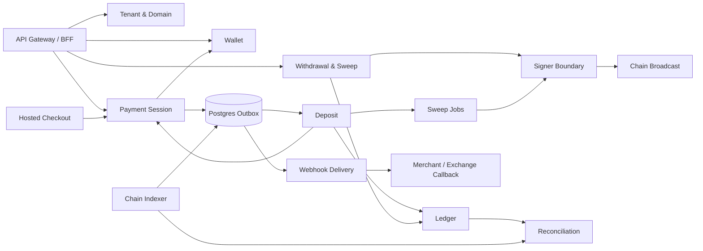
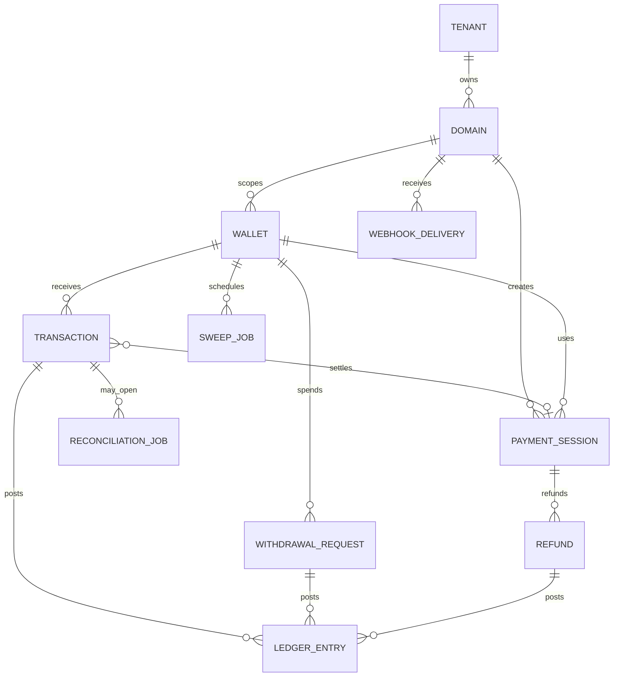
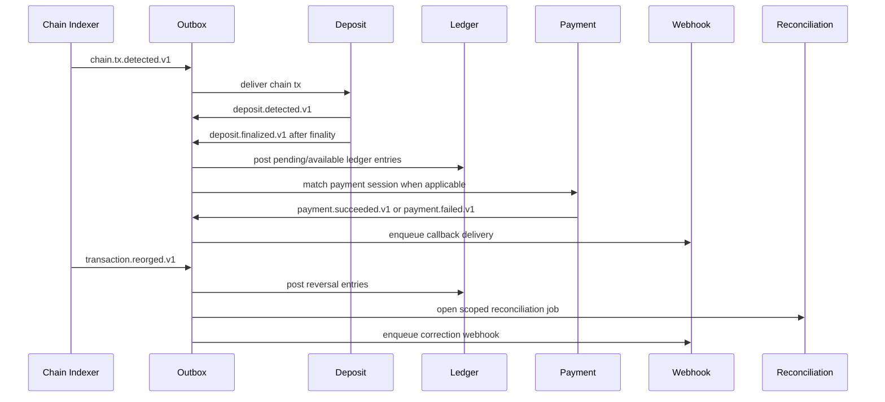
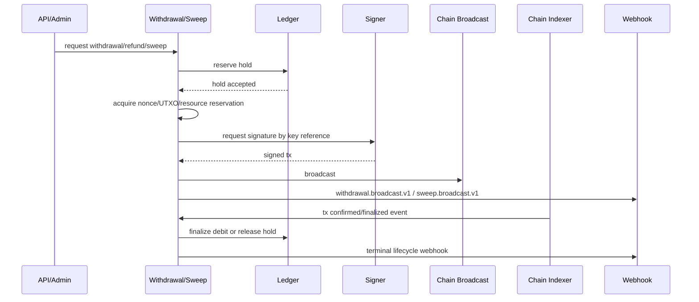

# Architecture Spine - Gateway Payment & Wallet Platform

## Design Paradigm

Modular-monolith-first, event-driven money platform.

The current Go monolith remains the runtime shell until money invariants are stable. Inside that shell, modules must behave like future services: each owns its data, emits durable events, and exposes commands/queries through its boundary. Physical service extraction is a later deployment decision, not the first architectural move.



## Invariants & Rules

### AD-1 - Modular Monolith Before Physical Services [ADOPTED]

- **Binds:** all platform work
- **Prevents:** splitting money movement across services before ownership, idempotency, and reconciliation rules are stable.
- **Rule:** New work must first enforce module boundaries in the monolith: Wallet, Chain Indexer, Deposit, Ledger, Payment, Withdrawal/Sweep, Signer, Webhook, Reconciliation, Tenant/Admin. Physical extraction is allowed only after the same boundary has durable event contracts and integration tests.

### AD-2 - Two Product Surfaces, One Money Core

- **Binds:** merchant-payment-gateway, exchange-wallet-provider
- **Prevents:** duplicate payment and wallet ledgers, separate address ownership rules, and incompatible webhook lifecycles.
- **Rule:** Merchant checkout/static-address flows and exchange user-wallet flows must share Wallet, Chain Indexer, Deposit, Ledger, Signer, Webhook, and Reconciliation boundaries. Product-specific behavior belongs in Payment Session or Wallet Provider API layers, not in duplicated money movement code.

### AD-3 - Ledger Is The Balance Authority

- **Binds:** balance APIs, deposits, withdrawals, refunds, sweeps, reconciliation
- **Prevents:** balances diverging between transactions, payment sessions, wallet rows, sweep jobs, and external chain reads.
- **Rule:** Available, pending, hold, transit, and adjustment balances must be derived from Ledger entries only. `transactions`, `payment_sessions`, `withdrawal_requests`, `refunds`, and `sweep_jobs` may reference lifecycle state but must not be used as authoritative balance stores.

### AD-4 - Chain Indexer Produces Facts, Not Business State

- **Binds:** chain listeners, transaction rescan, reorg handling, finality
- **Prevents:** listeners directly marking payments paid, posting ledger entries, or triggering inconsistent callbacks.
- **Rule:** Chain Indexer owns block/slot progress, raw transaction/log extraction, provider health, finality signals, and reorg detection. It emits chain events with stable ids. Deposit/Payment/Ledger/Webhook components consume those events and mutate business state.

### AD-5 - All Money Lifecycle Changes Are Idempotent Events

- **Binds:** deposit, payment, withdrawal, refund, sweep, webhook, reorg, reconciliation
- **Prevents:** duplicate credits, duplicate withdrawals, repeated fulfillment, and incompatible consumer dedupe behavior.
- **Rule:** Every money-affecting transition must have a stable idempotency key and a versioned event name. Event ids are part of the public contract for merchant and exchange integrations.

### AD-6 - Signer Boundary Is Mandatory For Production Custody

- **Binds:** withdrawals, refunds, sweeps, reserve movement, production wallet provider launch
- **Prevents:** process-memory mnemonic custody, private-key leakage, and app-database key custody.
- **Rule:** Application services request signatures by key reference, chain, derivation/account context, transaction intent, and policy metadata. Mnemonics/private keys must not be returned to application code, stored in the app database, or logged. `SIGNER_MODE=software` is development-only.

### AD-7 - Withdrawal And Sweep Require Reservation Before Signing

- **Binds:** payouts, exchange withdrawals, refunds, auto-sweeps, gas prefund
- **Prevents:** negative balances, double-spend race conditions, duplicate broadcast retries, nonce conflicts, and UTXO reuse.
- **Rule:** No outbound transaction may be signed before Ledger hold/reservation succeeds and chain-specific ownership is acquired: nonce reservation for account chains, UTXO reservation for Bitcoin-like chains, and resource/gas policy reservation where applicable. Retry workers must reconcile existing broadcast state before creating a replacement transaction.

### AD-8 - Webhook Delivery Is A Boundary, Not Inline Side Effect

- **Binds:** merchant callbacks, exchange callbacks, replay, dead letters, diagnostics
- **Prevents:** payment/deposit/withdrawal code blocking on merchant systems or each module inventing callback semantics.
- **Rule:** Source modules enqueue versioned webhook events; Webhook owns URL validation at delivery time, HMAC signing, retry/backoff, dead-letter state, replay, per-attempt logs, and merchant/exchange diagnostics. Payment, deposit, withdrawal, refund, sweep, and correction events must all use this boundary.

### AD-9 - Postgres Outbox Is The First Durable Event Substrate

- **Binds:** modular monolith phase, retry workers, future service extraction
- **Prevents:** in-memory dispatcher loss, premature Kafka/NATS/SQS coupling, and non-replayable money events.
- **Rule:** Inside the monolith, durable business events must first land in a Postgres outbox table in the same transaction as the state change. External brokers are deferred until throughput, partitioning, retention, or independent worker deployment requires them.

### AD-10 - Tenant Is The Architecture Name; Merchant/Domain Is Current API Shape

- **Binds:** auth, API keys, webhook subscriptions, ledger accounts, wallet ownership
- **Prevents:** exchange customers and e-commerce merchants needing separate platform models for the same ownership concept.
- **Rule:** Architecture-level ownership is `tenant/domain`. Current code may expose `merchant/domain`, but new boundaries and events must avoid assuming every tenant is only an e-commerce merchant.

### AD-11 - Reconciliation Is A First-Class Recovery Path

- **Binds:** chain replay, reorg correction, webhook replay, ledger drift, stuck withdrawal/sweep
- **Prevents:** manual-only recovery, silent ledger/chain mismatch, and blind retries.
- **Rule:** Any component that detects uncertain money state must open a reconciliation job with a bounded scope and reason. Reconciliation compares chain facts, ledger entries, lifecycle state, webhook delivery, and broadcast state before resolving or retrying.

### AD-12 - Real-Funds Production Requires Operational Gates

- **Binds:** production environments, deployment, migrations, observability, support, custody launch
- **Prevents:** taking customer funds on a build that can process money but cannot be safely operated, audited, restored, or debugged.
- **Rule:** Before real customer funds at public or exchange scale, each money path must have versioned migrations, environment separation, structured logs, metrics, traces, SLOs, alerts, incident runbooks, backup/restore drills, signer audit logs, withdrawal approval audit logs, and reconciliation dashboards.

## Consistency Conventions

| Concern | Convention |
| --- | --- |
| Module ownership | Only the owner boundary writes its owned tables. Other modules call owner commands or consume owner events. |
| Event names | Public and internal money events use dotted versioned names for new contracts: `deposit.finalized.v1`, `payment.succeeded.v1`, `withdrawal.broadcast.v1`, `refund.succeeded.v1`, `sweep.failed.v1`, `transaction.reorged.v1`. Existing underscore webhook names such as `payment_succeeded` remain compatibility aliases until an event catalog migration retires them. |
| Event ids | Event ids must be stable and consumer-safe. Chain tx events use `chain_id:tx_hash:log_index`; payment events use `payment_id:event_type`; withdrawal/refund/sweep events use their entity id plus transition. |
| Idempotency | Merchant/exchange write APIs accept idempotency keys; internal ledger postings and outbox inserts enforce uniqueness at the DB level. |
| Amounts | On-chain amounts are raw integer strings plus decimals/symbol/token metadata. Fiat display amounts are snapshots, not recalculated from current oracle prices. |
| Status mutation | Status changes happen through repository/service methods that also write ledger/outbox/reconciliation side effects in one transaction where possible. |
| Webhook security | Webhooks are HMAC-signed using the domain webhook secret, include event id, event type, timestamp, and event version, and re-validate callback URL at delivery time. |
| Balance reads | Balance APIs read Ledger projections or Ledger-derived queries only. They do not sum transaction rows or poll chain balances inline. |
| Reorg/correction | Corrections are compensating events and ledger reversals, not destructive edits to posted money history. |
| Production signing | Software signing is not a production custody option. Production requires external signer integration and signer audit logs. |

## Stack

| Name | Version / Source |
| --- | --- |
| Go | `1.25.4` from `go.mod` |
| Gofiber | `v3.3.0` from `go.mod` |
| GORM | `v1.31.1` from `go.mod` |
| PostgreSQL driver | `gorm.io/driver/postgres v1.6.0` from `go.mod` |
| Trust Wallet Core binding | local `replace tw => ./third_party/trustwallet/wallet-core/samples/go` |
| go-ethereum | `v1.17.2` from `go.mod` |
| btcd | `v0.25.0` from `go.mod` |
| gagliardetto/solana-go | `v1.12.0` from `go.mod` |
| OKX wallet SDK Tron | `github.com/okx/go-wallet-sdk/coins/tron` from `go.mod` |
| Durable event substrate, phase 1 | PostgreSQL outbox |

## Structural Seed

### Target Module Boundaries

```text
internal/
  tenant/          # tenants/domains, API keys, webhook subscriptions
  wallet/          # HD index, address ownership, address lookup
  chainindexer/    # block scan, provider health, finality, reorg detection
  deposit/         # wallet matching, deposit lifecycle, payment matching input
  ledger/          # double-entry ledger, balances, holds, reversals
  payment/         # checkout/payment session lifecycle and quote snapshot
  withdrawal/      # payout/refund/withdrawal request, hold, approval, broadcast state
  sweep/           # deposit sweep jobs and gas prefund orchestration
  signer/          # external signing interface and signing policy
  webhook/         # delivery, retry, replay, dead letters, diagnostics
  reconciliation/  # scoped recovery jobs and drift detection
```

Current packages may migrate toward this shape without requiring an immediate source-tree rewrite.

### Core Entity Shape



### Money Event Flow



### Outbound Money Flow



## Capability -> Architecture Map

| Capability / Area | Lives in | Governed by |
| --- | --- | --- |
| E-commerce hosted checkout | Payment Session, Wallet, Webhook | AD-2, AD-3, AD-5, AD-8 |
| Static deposit address for merchants | Wallet, Deposit, Ledger, Webhook | AD-2, AD-3, AD-4, AD-5 |
| Exchange user wallet infrastructure | Wallet, Deposit, Ledger, Withdrawal, Signer | AD-2, AD-3, AD-6, AD-7 |
| Deposit detected/finalized webhooks | Chain Indexer, Deposit, Webhook | AD-4, AD-5, AD-8 |
| Payment success/failure/expired webhooks | Payment Session, Webhook | AD-5, AD-8 |
| Withdrawal/payout lifecycle | Withdrawal, Ledger, Signer, Webhook, Reconciliation | AD-3, AD-6, AD-7, AD-8, AD-11 |
| Refund lifecycle | Payment Session, Withdrawal, Ledger, Webhook | AD-3, AD-5, AD-7, AD-8 |
| Auto-sweep | Sweep, Ledger, Signer, Reconciliation | AD-6, AD-7, AD-11 |
| Reorg correction | Chain Indexer, Ledger, Payment, Webhook, Reconciliation | AD-4, AD-5, AD-11 |
| Exchange-grade scaling | Chain Indexer, Outbox, Webhook, Reconciliation | AD-1, AD-4, AD-9, AD-11 |
| Real-funds production operations | Deployment, DB migrations, observability, support, audit | AD-12 |

## Deferred

| Decision | Deferred until |
| --- | --- |
| Specific production signer provider: AWS KMS, HSM, MPC vendor, Vault-backed signer | Provider, compliance, chain coverage, latency, and operational ownership are selected. |
| External broker selection: Kafka, NATS JetStream, SQS, RabbitMQ | Postgres outbox replay/throughput/partitioning limits are measured or independent service deployment requires it. |
| Physical service extraction order after first worker split | Modular monolith boundaries have contract tests and outbox consumers in staging. |
| Exact exchange-grade indexer sharding scheme | Target chain list, address count, block lag SLO, provider strategy, and archive-node access are committed. |
| AML/KYT/travel-rule integration | Target jurisdictions, customer type, and compliance provider are selected. |
| Custody tiering hot/warm/cold policy | Production signer and operational approval model are selected. |
| Merchant-facing webhook diagnostics UI shape | Event catalog and delivery model are finalized. |

## Open Questions

1. Who is the first production customer profile: e-commerce merchant, small exchange, or internal pilot?
2. Which signer class is acceptable for first real funds: cloud KMS, HSM, MPC vendor, or externally managed custody?
3. What event names must be publicly stable in v1: current `payment_succeeded` style or dotted `payment.succeeded.v1` style with aliases?
4. What are launch SLOs for deposit finality, webhook delivery, withdrawal broadcast, and reconciliation resolution?
